# 📐 Diagrammes d'Architecture - FHA
**Foundation Health Analyzer - Visualisation Complète**

---

## 🏗️ Architecture Globale

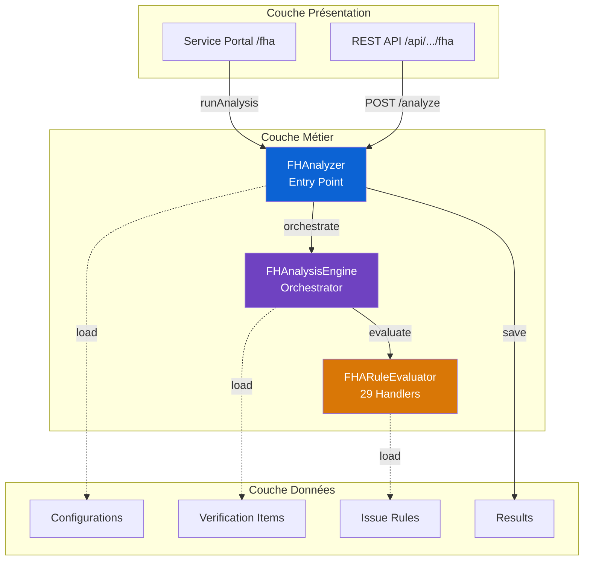

---

## 🔄 Flux d'Exécution d'une Analyse

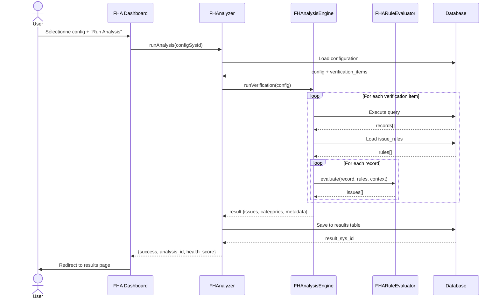

---

## 📊 Modèle de Données

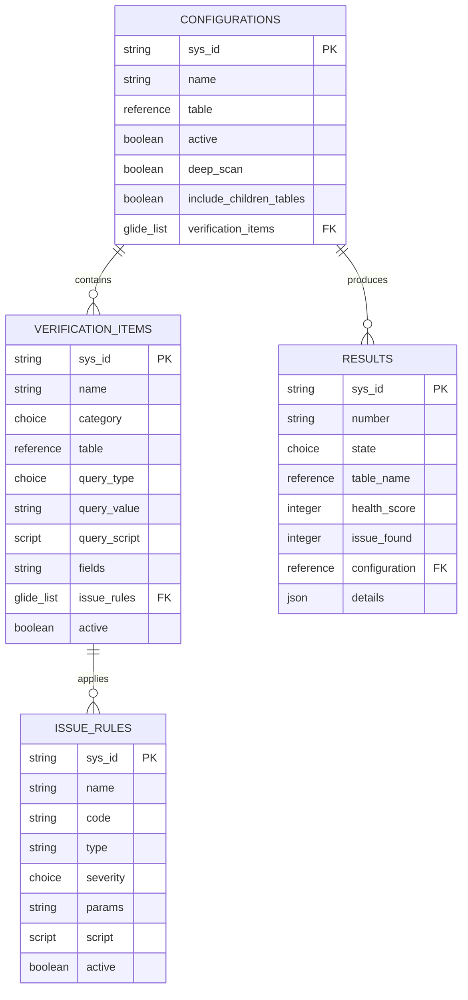

---

## 🎨 Architecture Service Portal

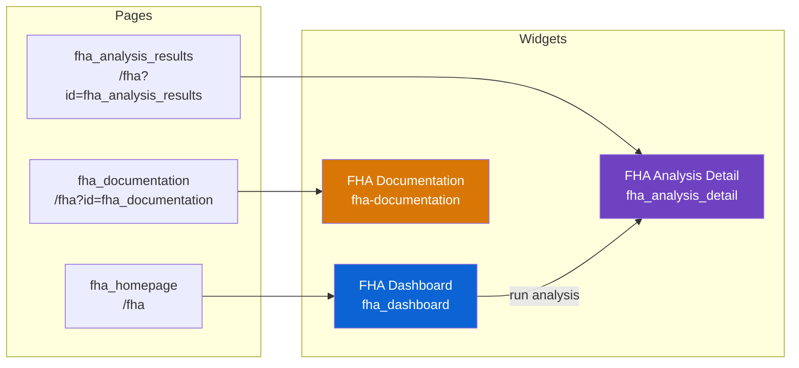

---

## 🔌 Architecture REST API

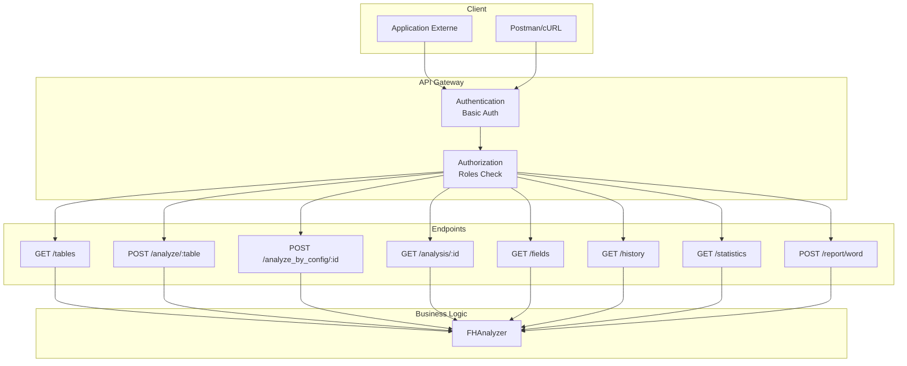

---

## 🧩 Système de Règles (Rule Engine)

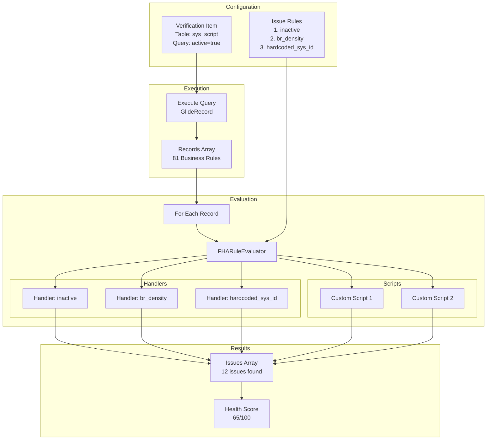

---

## 📦 Structure des Composants

```mermaid
graph TB
    subgraph "Script Includes ACTIFS"
        A1[FHAnalyzer<br/>~200 lines]
        A2[FHAnalysisEngine<br/>~400 lines]
        A3[FHARuleEvaluator<br/>~800 lines]
    end
    
    subgraph "Script Includes INACTIFS"
        I1[FHCheckTable]
        I2[FHCheckAutomation]
        I3[FHCheckIntegration]
        I4[FHCheckSecurity]
        I5[FHCheckRegistry]
        I6[FHAnalysisContext]
        I7[FHOptionsHandler]
        I8[FHScanUtils]
        I9[FHAUtils]
    end
    
    subgraph "Tables"
        T1[configurations]
        T2[verification_items]
        T3[issue_rules]
        T4[results]
    end
    
    subgraph "REST APIs"
        R1[/tables]
        R2[/analyze/:table]
        R3[/analyze_by_config/:id]
        R4[/analysis/:id]
        R5[/fields]
        R6[/history]
        R7[/statistics]
        R8[/report/word]
    end
    
    subgraph "Widgets"
        W1[FHA Dashboard]
        W2[FHA Analysis Detail]
        W3[FHA Documentation]
    end
    
    A1 --> A2
    A2 --> A3
    A1 -.-> T1
    A2 -.-> T2
    A3 -.-> T3
    A1 --> T4
    
    R1 --> A1
    R2 --> A1
    R3 --> A1
    R4 --> A1
    R5 --> A1
    R6 --> A1
    R7 --> A1
    R8 --> A1
    
    W1 --> A1
    W2 -.-> T4
    
    style A1 fill:#0c63d4,color:#fff
    style A2 fill:#6f42c1,color:#fff
    style A3 fill:#d97706,color:#fff
    style I1 fill:#dc2626,color:#fff
    style I2 fill:#dc2626,color:#fff
    style I3 fill:#dc2626,color:#fff
    style I4 fill:#dc2626,color:#fff
    style I5 fill:#dc2626,color:#fff
    style I6 fill:#dc2626,color:#fff
    style I7 fill:#dc2626,color:#fff
    style I8 fill:#dc2626,color:#fff
    style I9 fill:#dc2626,color:#fff
```

---

## 🎯 Handler Types (29 Handlers)

```mermaid
mindmap
  root((FHARuleEvaluator<br/>29 Handlers))
    CORE Handlers
      count_threshold
      br_density
      inactive
      system_created
      missing_field
      size_threshold
      duplicate
      hardcoded_sys_id
      field_check
      pattern_scan
      aggregate_metric
    LEGACY Handlers
      missing_acl
      acl_issue
      br_heavy
      cs_heavy
      ui_action
      job_error
      job_inactive
      flow_error
      flow_config
      ... 9 autres
    Custom Scripts
      JavaScript
      Access to item
      Access to context
      Return issues[]
```

---

## 🚀 Workflow Utilisateur Complet

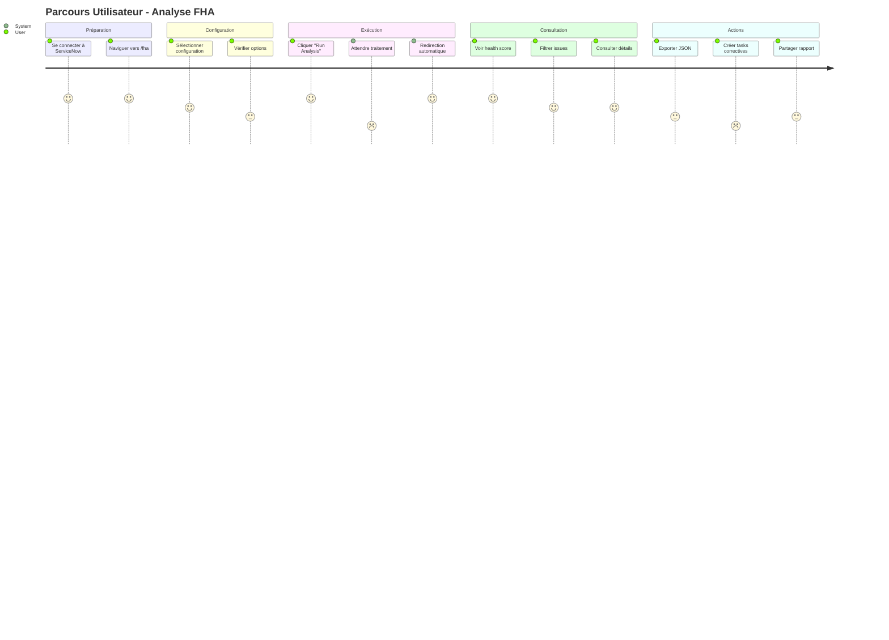

---

## 📊 Evolution de l'Architecture

```mermaid
timeline
    title Evolution FHA
    section v1.0 (Jan 2026)
        : Check Modules Architecture
        : FHCheckTable
        : FHCheckAutomation
        : FHCheckIntegration
        : Couplage fort
        : Difficile à étendre
    section v2.0 (Jan 2026)
        : Rule-Based Architecture
        : FHARuleEvaluator
        : 29 Handlers Built-in
        : Scripts Custom
        : Flexible & Extensible
    section v1.3 (17 Jan 2026 - Actuel)
        : Documentation Consolidée
        : 50+ pages
        : 29 handlers documentés
        : Guides cleanup
        : Widget documentation v1.3
    section Future (Q2-Q3 2026)
        : Tests ATF
        : Dashboard Analytique
        : Cache & Performance
        : AI Recommendations
```

---

## 💡 Pattern Handler : Individuel vs Agrégé

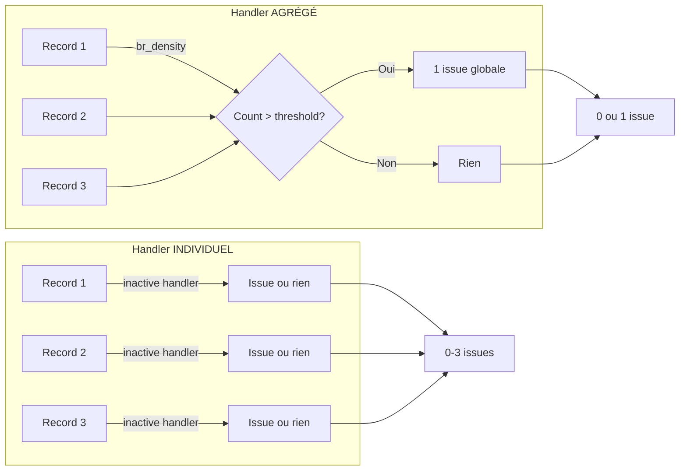

---

## 🔐 Sécurité & Rôles

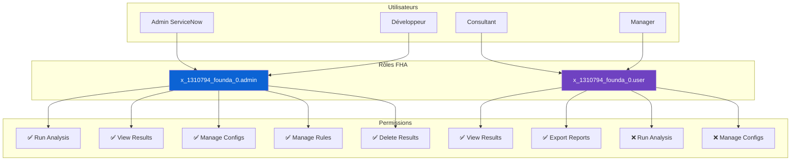

---

## 📈 Métriques & Performance

```mermaid
graph TB
    subgraph "Analyse Simple"
        S1[Config: Incident Basic]
        S2[Records: 1000]
        S3[Rules: 5]
        S4[Duration: 2-5 sec]
        S5[Issues: 0-10]
    end
    
    subgraph "Analyse Moyenne"
        M1[Config: User Complete]
        M2[Records: 5000]
        M3[Rules: 10]
        M4[Duration: 10-30 sec]
        M5[Issues: 10-50]
    end
    
    subgraph "Analyse Lourde"
        L1[Config: All BR Deep Scan]
        L2[Records: 50000]
        L3[Rules: 20]
        L4[Duration: 2-5 min]
        L5[Issues: 50-200]
    end
    
    S1 --> S2 --> S3 --> S4 --> S5
    M1 --> M2 --> M3 --> M4 --> M5
    L1 --> L2 --> L3 --> L4 --> L5
    
    style S1 fill:#16a34a,color:#fff
    style M1 fill:#d97706,color:#fff
    style L1 fill:#dc2626,color:#fff
```

---

## 🎨 Widget Dashboard - States

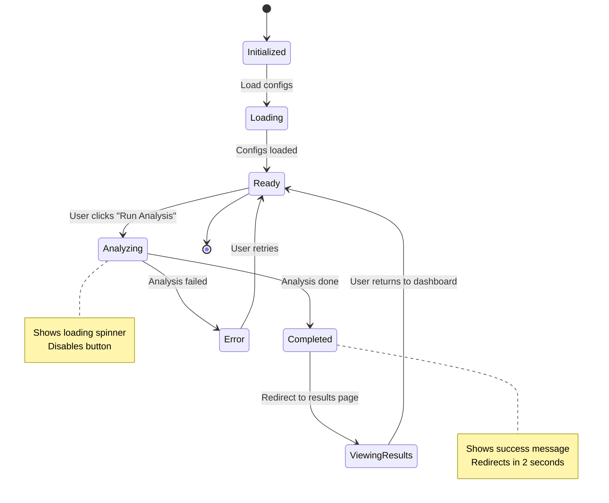

---

## 🔄 Cycle de Vie d'une Issue

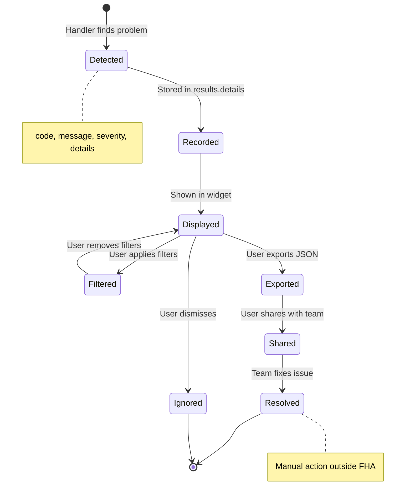

---

## 📦 Déploiement & Installation

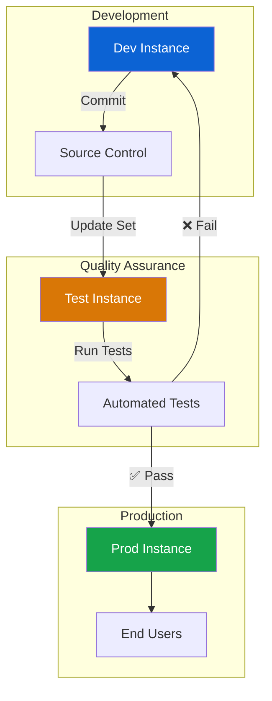

---

## 🎯 Roadmap Future

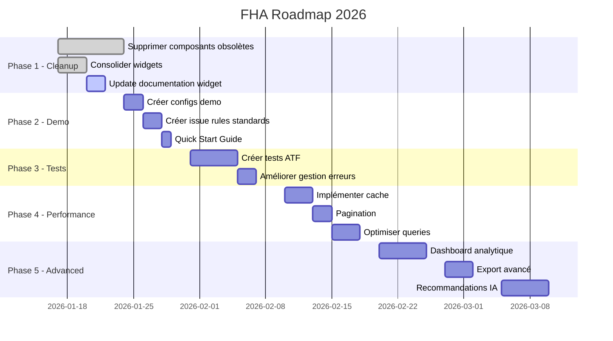

---

## 📊 Utilisation de ces Diagrammes

### Pour Présentation Client
1. **Architecture Globale** - Vue d'ensemble système
2. **Flux d'Exécution** - Comment ça marche
3. **Modèle de Données** - Stockage des informations
4. **Roadmap Future** - Vision long terme

### Pour Documentation Technique
1. **Structure des Composants** - Inventaire complet
2. **Système de Règles** - Rule engine détaillé
3. **Architecture REST API** - Intégrations
4. **Métriques & Performance** - Benchmarks

### Pour Développeurs
1. **Pattern Handler** - Comment créer handlers
2. **Cycle de Vie d'une Issue** - De la détection à la résolution
3. **Déploiement & Installation** - CI/CD
4. **Widget Dashboard - States** - Machine à états

---

## 💡 Comment Utiliser ces Diagrammes

### Dans PowerPoint/Keynote
1. Copier le code Mermaid
2. Aller sur https://mermaid.live
3. Coller le code
4. Export en PNG/SVG
5. Insérer dans slides

### Dans Markdown (GitHub, GitLab)
Les diagrammes s'afficheront automatiquement si Mermaid est supporté.

### Dans Confluence
Utiliser le plugin "Mermaid for Confluence" pour afficher les diagrammes.

### Dans ServiceNow
Créer un widget Service Portal avec la librairie Mermaid.js :
```html
<script src="https://cdn.jsdelivr.net/npm/mermaid/dist/mermaid.min.js"></script>
<div class="mermaid">
  <!-- Code mermaid ici -->
</div>
```

---

**Créé par** : Claude (Expert ServiceNow)  
**Date** : 17 janvier 2026  
**Version** : 1.0  
**Format** : Mermaid Diagrams

**Liens Utiles** :
- **Mermaid Live Editor** : https://mermaid.live
- **Mermaid Documentation** : https://mermaid.js.org
- **Retour Index** : [INDEX_DOCUMENTATION.md](../INDEX_DOCUMENTATION.md)
