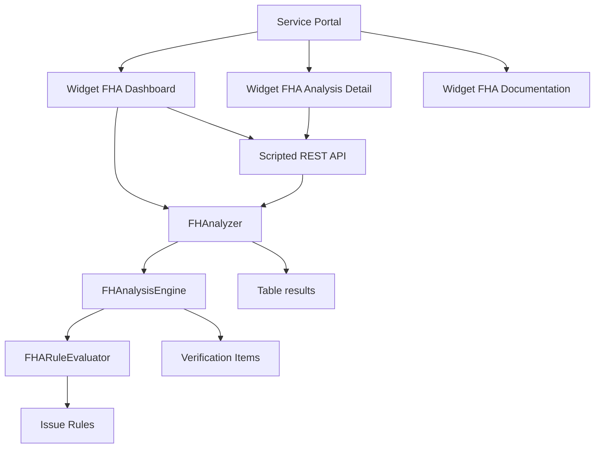

# Architecture

## Overview
FHA is a ServiceNow application composed of:
- Service Portal widgets (UI)
- Script Includes (analysis engine and rules)
- Custom tables (configurations, results, verification items, issue rules)
- Scripted REST API

## Global diagram (Mermaid)

## Key components
### Service Portal widgets
- `sp_widget_3ee88bd48312f21083e1b4a6feaad39a.xml`: FHA Analysis detail
- `sp_widget_5ada939c8392f21083e1b4a6feaad360.xml`: FHA Documentation
- Other widgets: dashboard, header, results (see `d852.../update/`)

### Script Includes (active)
- `FHAnalyzer` (`sys_script_include_f272658...`): main entry point
- `FHAnalysisEngine` (`sys_script_include_033a475...`): executes verification items and evaluates rules
- `FHARuleEvaluator` (`sys_script_include_cccafeed...`): applies rules

### Script Includes (inactive / legacy)
Several historical modules are disabled:
- `FHAnalysisEngine` (legacy version)
- `FHCheckTable`, `FHCheckAutomation`, `FHCheckIntegration`, `FHCheckSecurity`
- `FHScanUtils`, `FHOptionsHandler`, `FHAnalysisContext`, `FHCheckRegistry`

These modules are documented for context but not executed while `active=false`.

## Data model
### `x_1310794_founda_0_configurations`
- `name`, `table` (ref `sys_db_object`)
- `verification_items` (glide_list)
- Options: `deep_scan`, `include_children_tables`, `ignore_servicenow_records`, `include_ldap`

### `x_1310794_founda_0_verification_items`
- `category` (automation, integration, security, UI)
- `query_type` (encoded|script)
- `query_value`, `query_script`
- `fields` (CSV list)
- `issue_rules` (glide_list)
- `metadata` (JSON string)

### `x_1310794_founda_0_issue_rules`
- `name`, `code`, `type`, `severity`
- `params` (JSON string)
- `script` (custom script)
- `description`

### `x_1310794_founda_0_results`
- `number` (auto)
- `state` (In Progress, Completed, Error)
- `details` (JSON)

## Compatibility notes
- Some REST APIs still reference `_fha_*` tables in scripts.
- The main engine (`FHAnalyzer`) uses non-suffixed tables (`x_1310794_founda_0_configurations`, `x_1310794_founda_0_results`).
