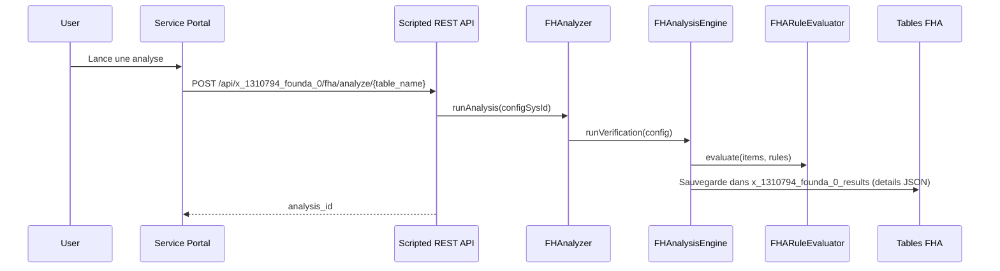

# Workflow d analyse

## Objectif
L analyse FHA s appuie sur une configuration, des verification items et des issue rules pour produire un resultat complet.

## Flux principal

## Etapes detaillees
1. Charger la configuration (`x_1310794_founda_0_configurations`).
2. Charger les verification items et leurs issue rules.
3. Executer les requetes (encoded ou script) pour collecter les records.
4. Appliquer les issue rules via `FHARuleEvaluator`.
5. Agreger les issues et stocker le JSON dans `details`.

## Resultat stocke
Le champ `details` contient:
- `config`: configuration resolue
- `issues`: liste agregee des issues
- `categories`: structure de categories (si produite)
- `verification_items`: items execut es
- `execution_metadata`: metadonnees
- `result`: data brute de l engine

## Points d attention
- Le moteur utilise `eval` pour les query scripts. Restreindre l acces aux roles FHA.
- Certaines APIs REST reference les tables `x_1310794_founda_0_fha_*` (voir `docs/api/endpoints.md`).
